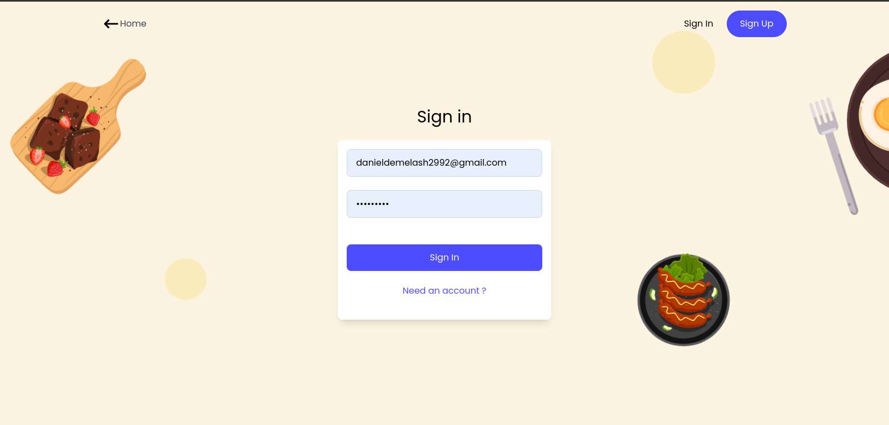
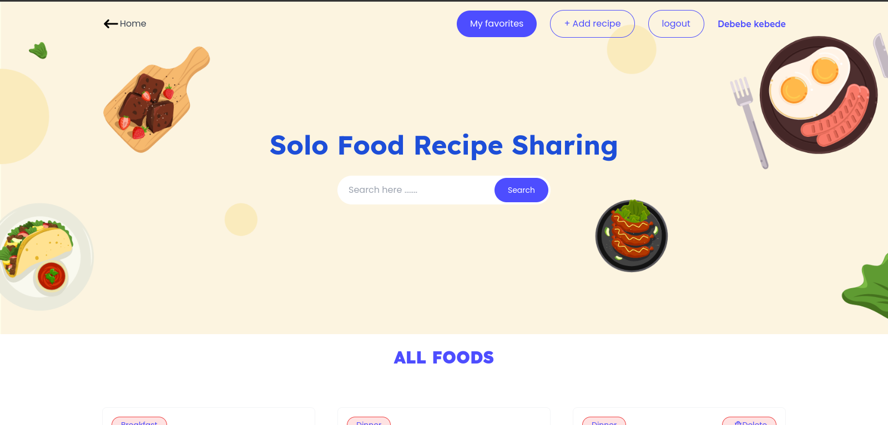
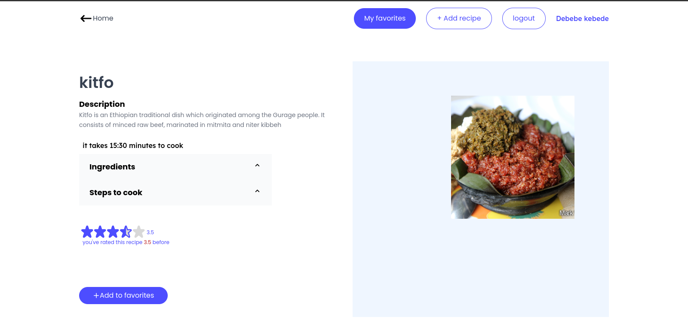
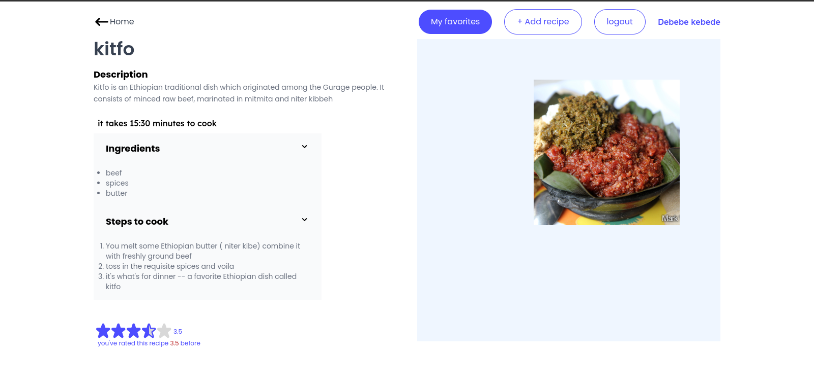
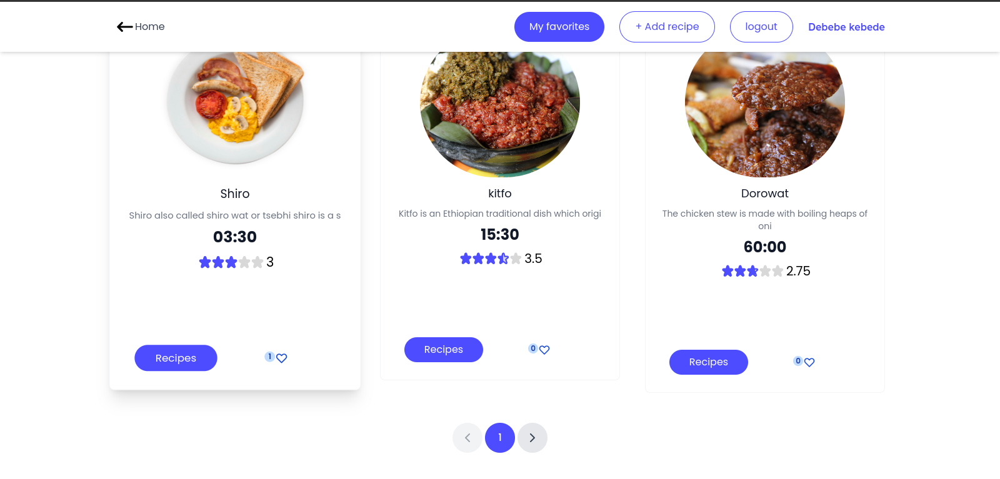
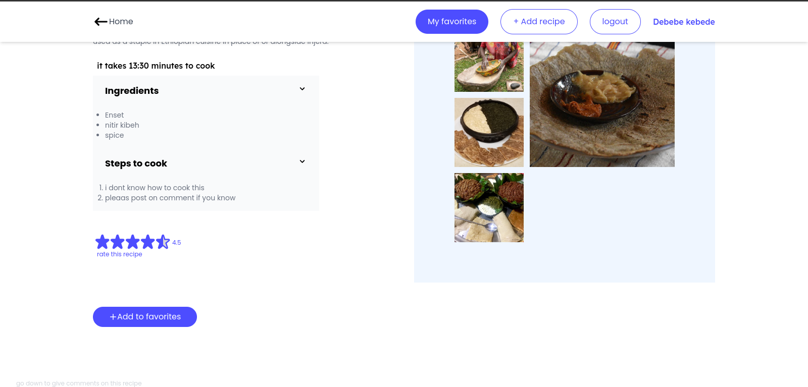
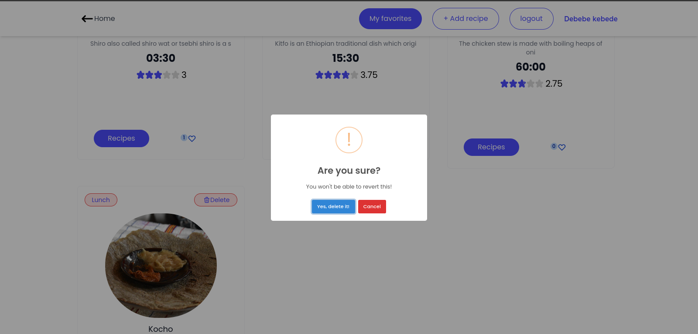
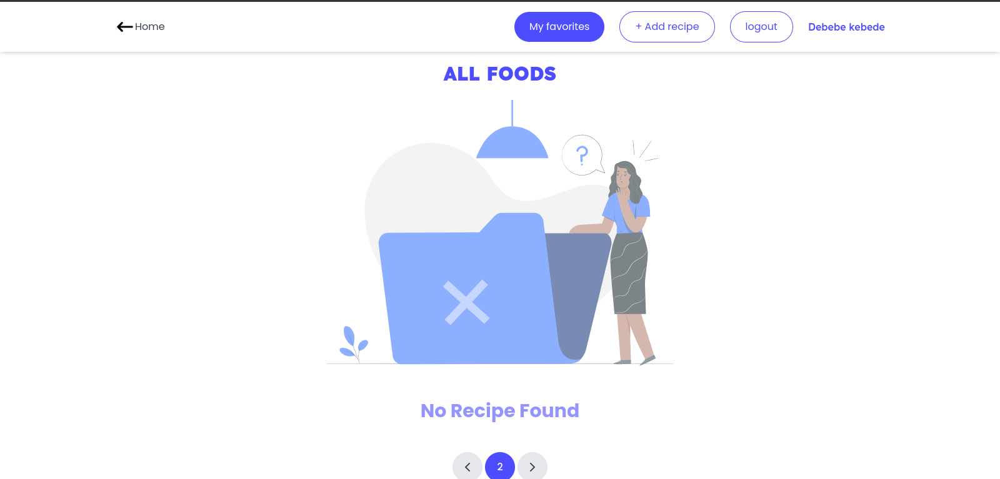

<br />
<div align="left">
  <h3 align="left">FOOD RECIPE APP FOR MINAB TECH RECRUIT ASSIGNMENT</h3>

### Built With

[![Vue][Vue.js]][Vue-url]


<!-- GETTING STARTED -->
## Getting Started

To set up this project Locally

### Prerequisites
* npm
  ```sh
  npm install npm@latest -g
  ```
 *nodemon
   ```sh
  npm install --global nodemon
  ```
  *yarn
  ```sh
  npm install --global yarn
  ```

### Installation


1. Clone the repo
   ```sh
   git clone https://github.com/solomonsitotaw23/recipeApp.git
   ```
2. Go to the backend folder and navgate to express
   ```sh
   npm install
   ```
3. and run the express server  `
   ```sh
   node index.js 
   ```
   or simply
     ```sh
   nodemon
   ```
4.  and run the docker and hasura inside the backend folder  `
   ```sh
  docker compose up
   ```
   and
     ```sh
 cd hasura && hasura metadata apply && hasura console
   ```
 now hasura console start running on port 9697
5.then go back to the recipe-app this is the front end part and run
     ```sh
     yarn && yarn dev
   ```
6. then the app start running on port 5173

<!-- PROJECT SCREENSHOT -->
##PROJECT SCREENSHOT









<!-- CONTACT -->
## Contact

Solomon Sitotaw-  solomonsitotaw9@gmail.com || solomonsitotaw23@gmail.com

[Vue.js]: https://img.shields.io/badge/Vue.js-35495E?style=for-the-badge&logo=vuedotjs&logoColor=4FC08D
[Vue-url]: https://vuejs.org/
